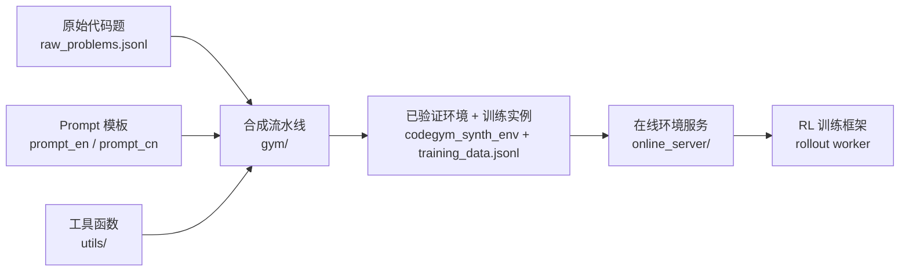
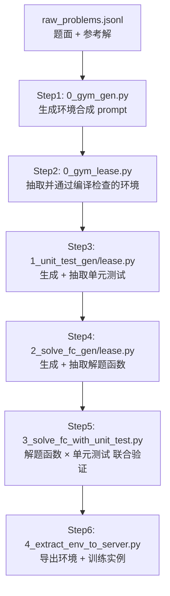

# CodeGym 技术报告

> 基于合成 CodeGym 的可泛化端到端工具调用强化学习
> （*Generalizable End-to-End Tool-Use RL with Synthetic CodeGym*, [arXiv:2509.17325](https://arxiv.org/abs/2509.17325)）

本报告面向研究人员，系统性梳理 CodeGym 项目的设计动机、整体架构、环境与奖励设计、合成与验证流水线、在线服务（大规模 RL rollout）实现、训练数据组织方式，以及所使用的关键库与框架等技术细节。所有结论均直接来自仓库源码。

---

## 1. 项目动机与核心思想

主流的工具调用 / 多轮交互（agentic）RL 训练面临一个核心瓶颈：**高质量、可验证、可规模化的交互式环境稀缺**。真实工具环境难以批量构造，且奖励信号往往不可靠。

CodeGym 的核心洞察是：**一道静态编程题的"解题过程"本质上就是一串工具调用序列**。把一份参考解法中的可复用逻辑（函数、子步骤）抽取出来，封装成一组**带文档的原子工具（actions）**，再把原题包装成一个 `gymnasium.Env` 交互式环境，agent 就必须**通过多轮调用这些工具**（而非直接写代码）来求解原问题。

由此得到的环境天然具备：

- **可验证性**：原题自带参考答案逻辑（`get_ref_answer`），奖励可自动判定；
- **可规模化**：流水线把海量静态代码题（Codeforces / LeetCode / Code Contests 等）自动批量转换为环境；
- **可泛化性**：训练出的工具调用行为可迁移到分布外（OOD）的多轮 / 工具调用 benchmark。

---

## 2. 整体架构

项目分为三大模块（对应仓库三个顶层目录）：



| 模块 | 路径 | 职责 |
|------|------|------|
| **合成流水线** | [gym/](gym/) | 把静态代码题 → 交互式 Gym 环境，并做正确性 / 可解性验证 |
| **Prompt 模板** | [prompt_en/](prompt_en/)、[prompt_cn/](prompt_cn/) | 环境生成、单元测试生成、解题函数生成的 few-shot 提示词（中英双语） |
| **在线服务** | [online_server/](online_server/) | 面向大规模 RL 的高并发环境托管服务 |
| **工具库** | [utils/](utils/) | 在线推理、parquet/jsonl I/O、docstring 抽取等辅助逻辑 |

---

## 3. 环境设计（Gym Environment）

每个合成环境是一个继承自 `gymnasium.Env` 的 Python 类，命名规范为 `{TaskName}Env`（如 `HouseRobberEnv`、`ModeFindingEnv`）。参考实现见 [example/example_envs/Code_Contests_26156_I__HouseRobberEnv.py](example/example_envs/Code_Contests_26156_I__HouseRobberEnv.py)。

### 3.1 标准接口契约

设计规范由 [prompt_en/task_description.txt](prompt_en/task_description.txt) 强约束，每个环境必须实现：

| 成员 | 作用 |
|------|------|
| `__init__(self, env_str=None)` | 定义动作常量、`func_mapping`（动作名 → 方法），并经 `from_env_str` 初始化 |
| `reset(self, options: dict)` | 用 `options` 字典重置内部状态，清零 `step_count`、`_reward`、`_done` |
| `from_env_str(s)` *(staticmethod)* | 字符串初始化，格式 `"EnvName@{...}"`，`{...}` 为参数字典 |
| `step(self, action: str)` | 接收 JSON 字符串动作，返回 `(bool, str)` —— 是否成功执行 + 结果观测 |
| `get_ref_answer(self)` | **仅依赖环境内部状态**计算参考答案（不接收外部参数），逻辑与原题解法一致 |
| `solve(self)` | 模拟 agent 通过 `step()` 调用动作完成全流程；**禁止直接访问 `self.xxx` 内部变量或参考答案** |
| `@property finished` | 回合是否结束（返回 `self._done`） |
| `@property reward` | 回合奖励（返回 `float(self._reward)`） |
| `if __name__ == "__main__"` | 必须含两个测试用例，打印验证结果与所用步数 |

### 3.2 动作（Action / Tool）设计原则

- **原子性 + 可复用**：动作命名采用 PascalCase，语义直观（如 `IncrementCounter`、`ComputeDpValue`、`SelectItemByIndex`）；
- **无隐式状态依赖**：参数显式传入，返回值显式产出（结构化数据用 `json.dumps` 序列化为字符串）；
- **完整 docstring**：每个动作必须含 `Args` / `Returns` / `Example Output`，这是后续转成"工具文档"喂给 LLM 的关键；
- **两个特殊动作必选**：
  - `Observe()`：让 agent 获取当前状态（部分环境为接口兼容保留空实现）；
  - `Done(answer)`：提交最终答案，与参考答案比对，写入奖励。

### 3.3 `step` 的执行模型

`step` 接收形如 `{"name": ActionName, "parameters": {...}}` 的 JSON 字符串：

1. `step_count += 1`；
2. `json.loads` 解析，校验 `name` / `parameters` 字段；
3. 经 `func_mapping` 派发到对应方法；
4. 参数缺失或动作非法时返回错误字符串（而非崩溃），保证 rollout 鲁棒；
5. 统一返回 `(True, msg)`——即**执行层面恒为成功**，逻辑正确性由后续 `Done` 判定。

> 设计要点：不在 `step` 中给出任何"提示或建议"，仅返回客观的状态变更信息，避免奖励泄漏 / 引导泄漏。

---

## 4. 奖励设计（Reward）

这是研究人员最关心的部分，CodeGym 的奖励设计有几个鲜明特征：

### 4.1 二元、稀疏、仅在终止时给出

- 奖励是 **0/1 二元**（默认），见 [online_server/README.md](online_server/README.md)："*By default, the reward is binary (0 or 1).*"
- **无中间奖励**（no intermediate rewards）：规范明确禁止过程奖励，只有 `Done` 时一次性结算。这强制 agent 学习完整的多步工具调用链，而非贪心地走捷径。

### 4.2 判定逻辑：参考答案对比

奖励由 `Done(answer)` 动作触发，核心逻辑（以 `HouseRobberEnv` 为例）：

```python
def Done(self, answer):
    ref_answer = self.get_ref_answer()
    correct = answer == ref_answer
    self._reward = 1 if correct else 0
    self._done = True
    return f"Your answer: {answer}, Reference answer: {ref_answer}, Result: {'Correct' if correct else 'Incorrect'}, reward={self._reward}"
```

- `get_ref_answer()` 复用**原题解法逻辑**在环境内重算标准答案，保证评测与原题一致；
- 对集合 / 无序结果会做归一化比较（如 `ModeFindingEnv` 用 `sorted(answer) == sorted(ref_answer)`）；
- 终止后 `finished=True`、`reward` 属性暴露结算值，供训练侧读取。

### 4.3 训练侧奖励读取（online server）

在线服务通过 `GET /reward` 暴露 `session.env.reward`（见 [online_server/online_server/env_server.py](online_server/online_server/env_server.py)）。rollout 客户端 [example_rollout_env.py](online_server/example_rollout_env.py) 中：

```python
@property
def reward(self):
    return int(self.env_client.reward() > 0)   # 归一化为 0/1
```

且网络异常 / 超时时奖励**降级为 0**（保守失败），避免脏奖励污染训练。

### 4.4 难度感知的数据过滤（隐式的"奖励塑形"）

虽然奖励本身二元，但项目通过 **`solve_fc_round`（参考解法所需调用步数）** 对训练实例做难度筛选（见 §7、[gym/4_extract_env_to_server.py](gym/4_extract_env_to_server.py)）：

- 默认仅保留 `min_solve_fc_round=10 ≤ solve_fc_round ≤ max_solve_fc_round=256` 的实例；
- 过滤掉过于平凡（步数太少）和过于冗长（步数过多）的任务，从课程难度层面间接控制学习信号质量。
- 训练实例还附带 `qwen32b_Bo4_score` / `qwen32b_Bo8_score` 等基线模型通过率字段（见 [example/training_instance.jsonl](example/training_instance.jsonl)），可用于难度分桶 / 课程学习。

---

## 5. 环境合成流水线（gym/）

完整六步流程（见 [gym/README.md](gym/README.md)），每步均支持 `--online-inference` 直接调 OpenAI 兼容 API，或导出 prompt 由自有 LLM 离线推理：



### Step 1 — 环境生成（[gym/0_gym_gen.py](gym/0_gym_gen.py)）

把每道题的 `question` / `solution` 填入 few-shot 模板 `GYM_GEN_PROMPT`（来自 [prompt_en/gym_gen_prompt.py](prompt_en/gym_gen_prompt.py)），模板内嵌：任务规范、示例题面、示例解法、示例 Gym 任务、示例 Gym 环境。输出待推理的 prompt。

### Step 2 — 编译过滤（`0_gym_lease.py`）

从 LLM 输出中抽取环境代码，做**编译 / 可加载性检查**，仅保留无语法错误的环境。

### Step 3 — 单元测试生成（`1_unit_test_gen.py` + `1_unit_test_lease.py`）

用 [prompt_en/hard_unit_test_gen_prompt.py](prompt_en/hard_unit_test_gen_prompt.py) 让 LLM 为每个环境生成 ~10 个**较难**测试用例，严格要求：

- 输入必须是**合法 JSON**（禁止 `[1]*5`、列表推导等 Python 表达式）；
- 格式统一为 `EnvClassName@{JSON参数}`；
- 覆盖典型与边界情况，鼓励大规模 / 复杂结构输入。

### Step 4 — 解题函数生成（`2_solve_fc_gen.py` + `2_solve_fc_lease.py`）

用 [prompt_en/solve_fc_task_description.txt](prompt_en/solve_fc_task_description.txt) 让 LLM 生成 `solve(self)` 参考解题函数，硬约束：

- **只能**通过 `self.step()` 调用动作，**禁止**写常规代码求解；
- **禁止**访问内部变量 `self.xxx` 或参考答案函数；
- 用 `<answer>...</answer>` 包裹。

### Step 5 — 联合验证（[gym/3_solve_fc_with_unit_test.py](gym/3_solve_fc_with_unit_test.py)）

这是**可解性验证**的核心，决定一个环境是否最终被采纳：

- 对每个环境，取其 `solve_fc` 候选 × 全部单元测试做笛卡尔积并行评测；
- 每条测试在**独立子进程**中运行（`multiprocessing.Pipe` + `Process`），施加：
  - **超时限制**（`run_task_with_timeout`，默认每条 task 2–3s，全局 15s）；
  - **内存限制**（`tracemalloc` 监控峰值，默认上限 `max_mem=100MB`）；
- 判定：测试输出中含 `reward=1` 记为通过，记录步数；超时 / 超内存 / 出错记为 `-1`；
- 仅当某个 `solve_fc` **通过该环境的所有单元测试**（`ans_collection` 全为正且无 `-1/0`），该环境才被标记为 valid，连同 `gym_env` / `docstring` / 带 `solve_fc_round` 的测试列表落盘为 JSON；
- 工程上用 **128 个 worker 进程**（`spawn` 启动）+ 任务/结果队列做大规模并行，并含 `resume_mode` 断点续跑与优雅清理。

### Step 6 — 导出到服务（[gym/4_extract_env_to_server.py](gym/4_extract_env_to_server.py)）

- 将验证通过的环境代码写入 `env_target_dir`（文件名 `{code_id}__{EnvName}.py`）；
- 为每个满足难度区间的单元测试生成一条**训练实例**（见 §7）；
- 用 [utils/docstrong_format.py](utils/docstrong_format.py) 的 `remove_self_and_example_for_prompt` 把环境动作 docstring 转成**纯函数签名文档**（去掉 `self`、去掉 Example Output），作为 system prompt 中的"工具清单"。

---

## 6. 在线环境服务（online_server/）

面向**大规模 RL rollout** 的两层高并发架构。

### 6.1 实例管理器（[env_instance_manager.py](online_server/online_server/env_instance_manager.py)）

一个 FastAPI 服务，负责管理一池子 `uvicorn` 子进程（每个子进程是一个 `env_server`）：

- **端口池**：`PortMonitor` 从 10000 起探测可用端口，为每个 worker 拉起 `uvicorn env_server:app --port <p> --workers 1`；
- **优先队列调度**：`PriorityQueue`（最小堆，按时间戳）维护空闲实例，`/get_instance` 取一个并做 `health_check`（进程存活性），不健康则重启；`/release_instance` 归还；
- **TTL 自动回收**：后台线程每 10 分钟扫描，超过 3 小时未用的已分配实例自动回收到空闲池；进程退出时 `atexit` 统一清理；
- 默认可拉起多达 `--workers 1024` 个实例。

**worker 数量需求公式**（GRPO 为例，见 README）：

```
num_workers > training_batch × samples_per_instance + validation_batch
            = 32 × 8 + 128 = 384
```

### 6.2 环境服务（[env_server.py](online_server/online_server/env_server.py)）

每个 `uvicorn` 子进程托管多个 session，提供 REST 接口：

| 接口 | 作用 |
|------|------|
| `POST /start` | 按 `env_str` 经 `server_config.get_class` 动态加载环境类并实例化，建立 session |
| `POST /step` | 在**独立子进程**中执行一步动作（`dill` 序列化 env → 子进程 → 反序列化回写），带超时 kill |
| `GET /is_done` | 读 `env.finished` |
| `GET /reward` | 读 `env.reward` |
| `GET /is_success` | 读 `env.success()` |
| `POST /reset` / `POST /stop` | 重置 / 销毁 session |

关键工程细节：

- **每步隔离执行**：`step` 用 `multiprocessing.Process` + `dill.dumps/loads` 在子进程跑动作，超时则 `p.kill()`，防止单个恶意 / 死循环动作卡死整个 worker（合成代码不可信，必须沙箱化）；
- **超时余量**：`total_time = max(3, timeout - SAFETY_MARGIN)`；
- **内存治理**：`asyncio` 周期任务每 5 分钟 `gc.collect()` 并打印 RSS；session 超 3 小时空闲自动清理；
- **动态环境加载**：[server_config.py](online_server/online_server/server_config.py) 扫描 `envs/codegym_v1/` 下所有 `*.py`，按文件名前缀建立 `prefix → file` 映射，按需 `importlib` 动态导入环境类并缓存。

### 6.3 Rollout 客户端（[example_rollout_env.py](online_server/example_rollout_env.py)）

供训练框架的 rollout 侧接入，关键设计：

- `EnvManagerClient` / `EnvClient`：带**指数退避重试**（`retry_function`）封装 manager 与 env 的 HTTP 调用；
- `OnlineGymEnv.from_env_str`：解析 `codegym_v1@<EnvName>@<JSON配置>`，自动取实例、起 session；
- `OnlineFcGymEnv.step`：
  - 解析动作（容错处理 `[...]` 包裹、JSON 校验）；
  - **连续错误熔断**：连续报错超 `ERROR_ALLOW_TIMES=5` 次后把单步超时压到 1s，快速失败；
  - **动作级统计**：线程安全地统计每个动作的 success/failure，便于诊断哪些工具最常被错误调用；
- `reward` 属性归一化为 `int(reward > 0)`，`release()` 负责归还实例并 `/stop` 清理 session。

### 6.4 环境-训练接口约定

`step(action_str) -> obs_str`、`finished() -> bool`、`reward() -> int`、`from_env_str(env_str)` 四个方法构成训练框架与环境之间的最小契约（见 [online_server/README.md](online_server/README.md)），训练框架可按需适配。

---

## 7. 训练数据组织与 RL 训练

### 7.1 训练实例格式

由 Step 6 产出，每条形如（见 [example/training_instance.jsonl](example/training_instance.jsonl)）：

```jsonc
{
  "ability": "codegym_v1@<EnvName>@{JSON参数}",   // 环境与初始化配置
  "data_source": "codegym_v1",
  "prompt": [
    { "role": "system", "content": "<工具函数签名文档>", "name": "functions" },
    { "role": "user",   "content": "<任务说明 + gym_task>" }
  ],
  "reward_model": { "ground_truth": null, "style": "agent_env" },  // 奖励来自环境交互，非静态标签
  "plugin_call_max_round": 256,    // 单回合最大工具调用轮数
  "extra_info": {
    "gym_env": "<环境完整源码>",
    "solve_fc_round": 18,          // 参考解所需步数（难度代理）
    "qwen32b_Bo4_score": 0.25      // 基线通过率（可选，用于难度分桶）
  }
}
```

要点：
- `reward_model.style = "agent_env"` 且 `ground_truth = null` —— 明确表示**奖励通过与环境的多轮交互在线产生**，而非比对静态答案；
- system prompt 是经 docstring 抽取得到的**工具清单**（函数名 + Args/Returns），不含实现与示例输出，迫使模型靠探索理解工具；
- user prompt（[gym/4_extract_env_to_server.py](gym/4_extract_env_to_server.py) 中 `USER_PROMPT_EN/CN`）显式规定交互协议：**禁止写代码、每步至多一个函数、必须等待工具返回、用 `<|FunctionCallBegin|>...<|FunctionCallEnd|>` 包裹 JSON 函数调用**。

### 7.2 RL 算法与训练循环

- README 与 worker 数量公式以 **GRPO**（Group Relative Policy Optimization）为参考算法：每个训练实例采样 `samples_per_instance`（示例为 8）条轨迹，做组内相对优势估计；
- 训练循环：训练框架从 manager 取环境实例 → 用 `ability` 中的 `env_str` 起 session → 模型多轮 `step` 交互（至多 `plugin_call_max_round=256` 轮）→ 终止后读 `reward`（0/1）→ 计算优势并更新策略；
- 由于奖励**端到端、稀疏、可验证**，整个过程无需人工标注，可随环境池规模线性扩展。

> 注：本仓库**开源的是环境合成流水线 + 环境托管服务 + 训练数据格式**，具体的策略优化器（GRPO/PPO 实现）需由使用者自有的 RL 训练框架提供，通过 §6.3 的 rollout 接口对接。

---

## 8. 关键库与框架

| 用途 | 库 / 框架 |
|------|-----------|
| 环境基类 / 接口规范 | **gymnasium**（Farama Gym 接口） |
| 在线服务 / REST API | **FastAPI** + **uvicorn**（ASGI） |
| 异步并发 / 生命周期 | **asyncio**（session 清理、周期 GC） |
| 进程级沙箱与并行 | **multiprocessing**（spawn、Pipe、Queue、Process） |
| 跨进程对象序列化 | **dill**（比 pickle 更强，可序列化复杂 env 对象） |
| 资源监控 | **psutil**（RSS 内存）、**tracemalloc**（峰值内存）、`socket`（端口探测） |
| 数据 I/O | **pandas** + **pyarrow**（parquet）、jsonl（[utils/parquet_utils.py](utils/parquet_utils.py)、[utils/utils.py](utils/utils.py)） |
| HTTP 客户端 | **requests**（带指数退避重试） |
| LLM 推理 | **OpenAI 兼容 API**（[utils/online_inference.py](utils/online_inference.py)，`--online-inference`） |
| 代码静态分析 | **ast**（docstring / `func_mapping` 校验，[utils/gym_to_docstring.py](utils/gym_to_docstring.py)） |
| 进度 / CLI | **tqdm**、**argparse** |

运行环境：`conda` + **Python 3.11.2**（见 [online_server/README.md](online_server/README.md)），依赖见 [online_server/requirements.txt](online_server/requirements.txt)。

---

## 9. 设计取舍与亮点小结

1. **"解题过程即工具序列"**：用静态代码题自动合成可验证交互环境，绕开了真实工具环境稀缺的瓶颈。
2. **奖励极简而可靠**：二元、稀疏、仅终止结算、靠原题逻辑自动判定，从根本上杜绝过程奖励泄漏与脏标签。
3. **多重自动验证关卡**：编译检查 → 难单元测试 → 解题函数 × 单元测试联合验证（带超时/内存沙箱），层层过滤出"既正确又可解"的环境。
4. **难度可控的课程**：以 `solve_fc_round` 与基线通过率作为难度代理做数据筛选与分桶。
5. **可信沙箱化执行**：合成代码不可信，故每步动作进程级隔离 + 超时 kill + 周期 GC + TTL 回收，保障大规模 rollout 的稳定性。
6. **两层服务架构**：实例管理器（调度/健康检查/回收）+ 环境服务（session/step 隔离），配合重试与熔断的 rollout 客户端，可支撑数百到上千并发环境。
7. **与训练框架解耦**：通过简洁的 `from_env_str/step/finished/reward` 契约接入任意 RL 框架（GRPO 等）。

---

## 10. 复现路线图（TL;DR）

```bash
# 合成（gym/）
python gym/0_gym_gen.py            --online-inference   # 生成环境
python gym/0_gym_lease.py                               # 编译过滤
python gym/1_unit_test_gen.py      --online-inference
python gym/1_unit_test_lease.py                         # 单元测试
python gym/2_solve_fc_gen.py       --online-inference
python gym/2_solve_fc_lease.py                          # 解题函数
python gym/3_solve_fc_with_unit_test.py                 # 联合验证
python gym/4_extract_env_to_server.py                   # 导出环境 + 训练实例

# 托管（online_server/）
conda create -n online_server python==3.11.2 && conda activate online_server
pip3 install -r online_server/requirements.txt
# 下载 HuggingFace 环境到 online_server/online_server/envs/codegym_v1/
python3 online_server/online_server/env_instance_manager.py --workers 384

# 训练：用自有 RL 框架经 example_rollout_env.py 接口对接，GRPO 在线交互产生 0/1 奖励
```

---

*本报告由对仓库源码的逐文件分析生成，引用均指向具体文件与实现位置。*
